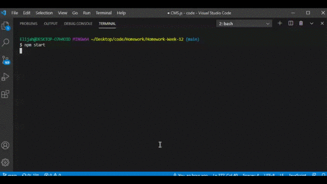

# Employee Tracker Database 
[](https://lbesson.mit-license.org/)

## Description

[]

Employee Tracker is a nodeJS based CLI with a mySQL database backend.  Its use is to help a company organize and manage employee roles, titles, salaries, and departments.  It utilizes the mySQL NPM package.

The program is built around the following schema.

[]

## Table of Contents

* [Installation](#installation)
* [License](#license)
* [Contributing](#contributing)
* [Questions/Contact](#questions/contact)


## Installation

Download the repo.

In MySQL workbench, run the contents of ```schema.sql``` and ```seeds.sql```.

To run the program, ```node CMS.js``` or ```npm start``` from a terminal at the program's directory.

Be sure to run ```npm i``` before starting the program to set up the requisite node modules.


## License

[](https://lbesson.mit-license.org/)

This project is covered under the MIT.  Click the badge above to learn more.


## Contributing

To contribute to the project, send me a message on github.


## Questions/Contact

 http://github.com/emelanson

 My email is (my first and last name)@gmail.com


  